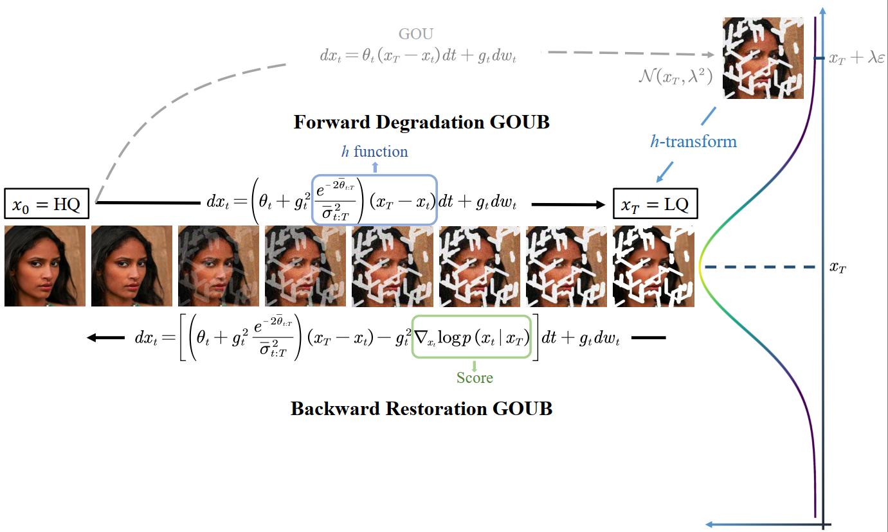

<h1 align="center"> Image Restoration Through Generalized Ornstein-Uhlenbeck Bridge </h1>

 
Conghan Yue*, Zhengwei Peng, Junlong Ma, Shiyan Du, Pengxu Wei, Dongyu Zhang

<i>Department of Computer Science, Sun Yat-sen University</i>  
*yuech5@mail2.sysu.edu.cn

<h3 align="center"> [<a href="https://arxiv.org/abs/2302.05872">arXiv</a>]</h3>

Official PyTorch Implementations of GOUB, a diffusion bridge model that applies the Doob's *h*-transform to the generalized Ornstein-Uhlenbeck process. This model can address general image restoration tasks without the need for specific prior knowledge.

# Intallation