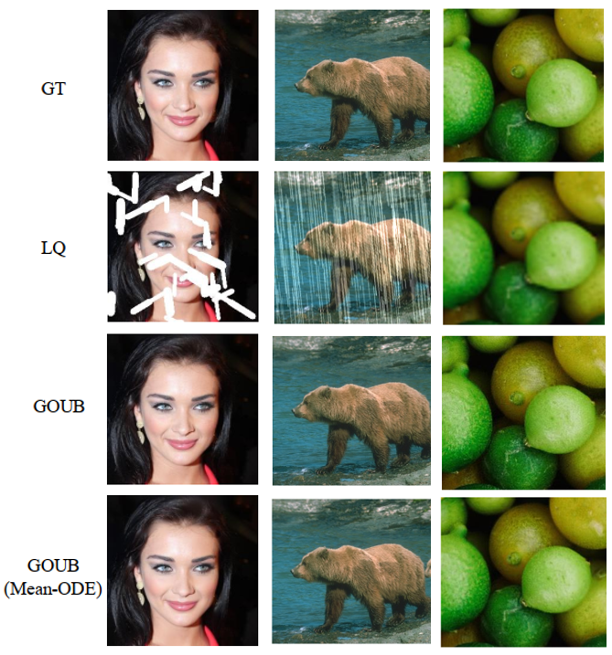

<h1 align="center"> Image Restoration Through Generalized Ornstein-Uhlenbeck Bridge </h1>

  Conghan&nbsp;Yue1</a> &ensp; <b>&middot;</b> &ensp;
  Zhengwei&nbsp;Peng</a> &ensp; <b>&middot;</b> &ensp;
  Junlong&nbsp;Ma</a> &ensp; <b>&middot;</b> &ensp;
  Shiyan&nbsp;Du</a> &ensp; <b>&middot;</b> &ensp;
  Pengxu&nbsp;Wei</a> &ensp; <b>&middot;</b> &ensp;
  Dongyu&nbsp;Zhang</a>
      
  1yuech5@mail2.sysu.edu.cn, Sun Yat-Sen University
  

<h3 align="center"> [<a href="https://arxiv.org/abs/2312.10299">arXiv</a>] [<a href="https://paperswithcode.com/paper/image-restoration-through-generalized">Papers With Code</a>]</h3>

Official PyTorch Implementations of GOUB, a diffusion bridge model that applies the Doob's *h*-transform to the generalized Ornstein-Uhlenbeck process. This model can address general image restoration tasks without the need for specific prior knowledge.

# Overview

    

# Visual Results

     

# Intallation
This code is developed with Python3, and we recommend python>=3.8 and PyTorch ==1.13.0. Install the dependencies with Anaconda and activate the environment with:

    conda create --name GOUB python=3.8
    conda activate GOUB
    pip install -r requirements.txt

# Test
1. Prepare datasets.
2. Download pretrained checkpoints [here](https://drive.google.com/drive/folders/1rxHiZTxNSlvM9VSoRUY_rdoDp8DBbX8C?usp=sharing).
3. Modify options, including dataroot_GT, dataroot_LQ and pretrain_model_G.
4. Choose a model to sample (Default: GOUB): test function in `codes/models/denoising_model.py`.
5. `python test.py -opt=options/test.yml`

The Test results will be saved in `\results`.

# Train
1. Prepare datasets.
2. Modify options, including dataroot_GT, dataroot_LQ.
3. `python train.py -opt=options/train.yml` for single GPU.  `python -m torch.distributed.launch --nproc_per_node=2 --master_port=1111 train.py -opt=options/train.yml --launcher pytorch` for multi GPUs. *Attention: see [Important Option Details](#important-option-details)*.

The Training log will be saved in `\experiments`.

# Interface
We provide the interface.py for the deraining, which can generate HQ only with LQ:
1. Prepare options/test.yml filling in LQ path.
2. `python interface.py`.
3. The interface will be on the local server: 127.0.0.1.

Other tasks can also be written in imitation.

# Important Option Details
* `dataroot_GT`: Ground Truth (High-Quality) data path.
* `dataroot_LQ`: Low-Quality data path.
* `pretrain_model_G`: Pretraind model path.
* `GT_size, LQ_size`: Size of the data cropped during training.
* `niter`: Total training iterations.
* `val_freq`: Frequency of validation during training.
* `save_checkpoint_freq`: Frequency of saving checkpoint during training.
* `gpu_ids`: In multi-GPU training, GPU ids are separated by commas in multi-gpu training.
* `batch_size`: In multi-GPU training, must satisfy relation: *batch_size/num_gpu>1*.

# FID
We provid a brief guidelines for commputing FID of two set of images:

1. Install FID library: `pip install pytorch-fid`.
2. Commpute FID: `python -m pytorch_fid GT_images_file_path generated_images_file_path --batch-size 1` if all the images are the same size, you can remove `--batch-size 1` to accelerate commputing.
