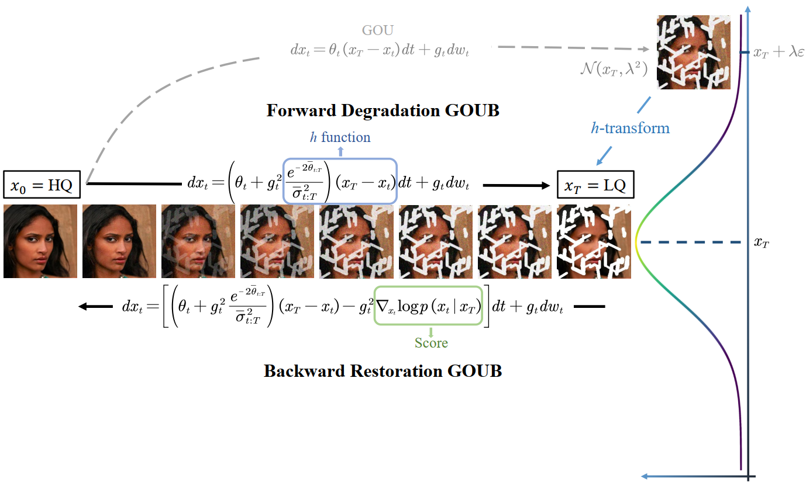
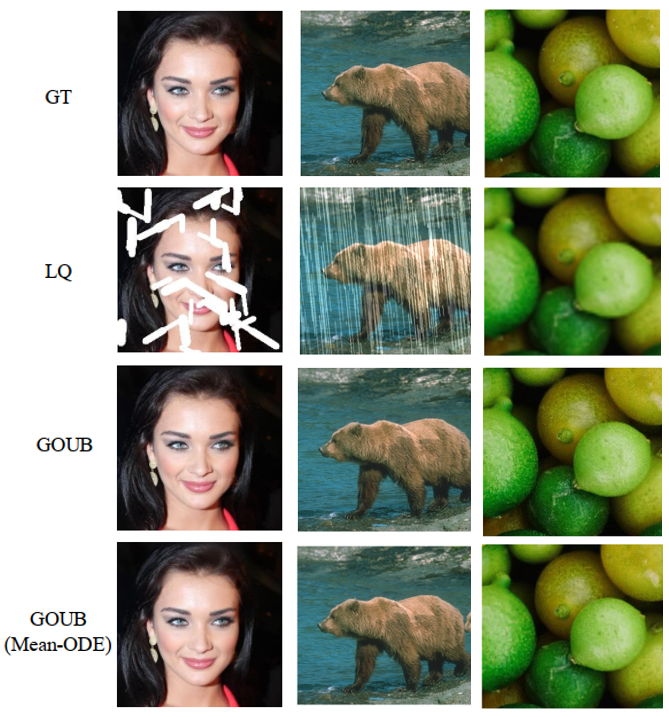

```markdown
<h1 align="center"> Image Restoration Through Generalized Ornstein-Uhlenbeck Bridge </h1>

<div align="center">
  Conghan&nbsp;Yue<sup>1</sup></a> &ensp; <b>&middot;</b> &ensp;
  Zhengwei&nbsp;Peng</a> &ensp; <b>&middot;</b> &ensp;
  Junlong&nbsp;Ma</a> &ensp; <b>&middot;</b> &ensp;
  Shiyan&nbsp;Du</a> &ensp; <b>&middot;</b> &ensp;
  Pengxu&nbsp;Wei</a> &ensp; <b>&middot;</b> &ensp;
  Dongyu&nbsp;Zhang</a>
  <br> <br> 
  <sup>1</sup>yuech5@mail2.sysu.edu.cn, Sun Yat-sen University
  
</div>
<h3 align="center"> [<a href="https://arxiv.org/abs/2312.10299">arXiv</a>] [<a href="https://paperswithcode.com/paper/image-restoration-through-generalized">Papers With Code</a>]</h3>


Official PyTorch implementation of GOUB, a diffusion bridge model that applies the Doob's *h*-transform to the generalized Ornstein-Uhlenbeck process. This model can address general image restoration tasks without requiring task-specific prior knowledge.

# Overview
<div align="center">
    
</div>

# Visual Results
<div align="center">
    <br>
</div>

# Installation
This code is developed with Python 3. We recommend Python >= 3.8 and PyTorch == 1.13.0. Install the dependencies with Anaconda and activate the environment with:

    conda create --name GOUB python=3.8
    conda activate GOUB
    pip install -r requirements.txt

# Test
1. Prepare the datasets.
2. Download the pretrained checkpoints [here](https://drive.google.com/drive/folders/1rxHiZTxNSlvM9VSoRUY_rdoDp8DBbX8C?usp=sharing). The datasets are also provided.
3. Modify the options, including `dataroot_GT`, `dataroot_LQ`, and `pretrain_model_G`.
4. Choose a model to sample. The default model is GOUB. See the test function in `codes/models/denoising_model.py`.
5. Run `python test.py -opt=options/test.yml`.

The test results will be saved in `\results`.

# Train
1. Prepare the datasets.
2. Modify the options, including `dataroot_GT` and `dataroot_LQ`.
3. Run `python train.py -opt=options/train.yml` for single-GPU training.<br> Run `python -m torch.distributed.launch --nproc_per_node=2 --master_port=1111 train.py -opt=options/train.yml --launcher pytorch` for multi-GPU training. *Note: see [Important Option Details](#important-option-details).*

The training logs will be saved in `\experiments`.

# Interface
We provide `interface.py` for deraining, which can generate high-quality images from low-quality inputs:
1. Prepare `options/test.yml` and fill in the LQ path.
2. Run `python interface.py`.
3. The interface will be launched on a local server at 127.0.0.1.

Other tasks can also be implemented similarly.

# Important Option Details
* `dataroot_GT`: Ground-truth high-quality data path.
* `dataroot_LQ`: Low-quality data path.
* `pretrain_model_G`: Pretrained model path.
* `GT_size, LQ_size`: Crop size of the data during training.
* `niter`: Total number of training iterations.
* `val_freq`: Validation frequency during training.
* `save_checkpoint_freq`: Checkpoint saving frequency during training.
* `gpu_ids`: In multi-GPU training, GPU IDs should be separated by commas.
* `batch_size`: In multi-GPU training, the following relation must be satisfied: *batch_size / num_gpu > 1*.

# FID
We provide brief guidelines for computing the FID between two sets of images:

1. Install the FID library: `pip install pytorch-fid`.
2. Compute FID: `python -m pytorch_fid GT_images_file_path generated_images_file_path --batch-size 1`.<br>If all images have the same size, you can remove `--batch-size 1` to accelerate computation.
```
